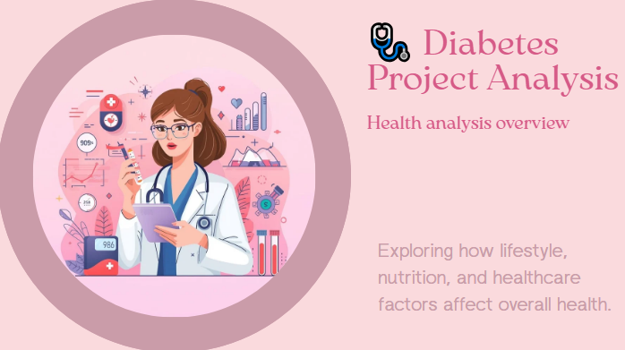

# 🩺 Medical & Health Data Analysis – "Diabetes"

Proudly presented by **Team Sugar Bytes 💗**

An end-to-end **Data Analytics & Visualization project** exploring how lifestyle, income, and education influence long-term health and diabetes risk.  
Our team transformed raw medical data into meaningful insights, revealing patterns that shape public health outcomes ✨.

---

## 📊 Project Overview

The **“Diabetes Data Analysis”** project uncovers how daily habits and social factors impact the likelihood of developing diabetes.  
Through data cleaning, preprocessing, analysis, and visualization — we turned complex datasets into clear, data-driven stories that help understand the connections between lifestyle and health.

We also built an **AI-powered chatbot 🤖** that allows users to interact with the dataset, ask analytical questions, and receive real-time visual and data-based insights.

---

## 🎯 Objectives

- Explore relationships between lifestyle, nutrition, and diabetes risk.  
- Identify correlations between income, education level, and health outcomes.  
- Use data visualization to communicate key medical and social findings.  
- Build an AI chatbot to make insights interactive and accessible.  
- Strengthen teamwork and creative problem-solving through real-world data.

---

## 🧩 Project Workflow

Our journey started with **data cleaning and preprocessing**, handling missing values and inconsistencies.  
Then, we conducted **exploratory data analysis (EDA)** to find hidden trends and correlations.  
Afterward, we created **interactive visualizations** using Power BI and Python to communicate insights effectively.  
Finally, we integrated an **AI chatbot** that enables users to query the data directly and receive visual responses in real time.  
The project concluded with a **presentation** that told a complete story — from raw data to actionable insights.  
---

## 🖼️ Project Thumbnail
  
*(Project main preview — from our presentation visuals)*

---

## 🛠️ Tools & Technologies

- **Power BI** – Data visualization & dashboard design  
- **Python** – Data cleaning, analysis, and AI chatbot  
- **Excel** – Initial data exploration & preprocessing  
- **Pandas / NumPy / Matplotlib / Seaborn**  
- **NLTK / Streamlit / OpenAI API** *(for chatbot interface)*  

---

## 💡 Key Insights

- People with **lower income and education** levels showed a **higher diabetes risk**.  
- **Lifestyle factors** (diet, activity, and sleep) had a measurable impact on glucose levels.  
- Visualizations revealed patterns linking **nutrition, BMI, and age** to diabetes likelihood.  
- The **AI chatbot** enabled users to explore insights interactively and in real time.

---

## 👩‍💻 Team Sugar Bytes 💗

- **Rania Elwan**  
- **Farah Sameh**  
- **Hanaa Edreis**  
- **Shaimaa Nasr**  
- **Yomna Ayman**  
- **Hoda Elkassas**  
- **Mariam Madkour**  
- **Merihan Elfeshawy**

_Supervised by **Dr. Maged Magdy**_

---

## 📢 LinkedIn Post

You can check our LinkedIn post for more visuals and highlights from the project presentation:  
[🔗 View Post on LinkedIn](https://www.linkedin.com/posts/raniaaa-elwan_dataanalysis-python-streamlit-activity-7385772457963458560-dUFr?utm_source=share&utm_medium=member_desktop&rcm=ACoAAEfQjFIB5CtFymhWh2lMQ0NAyTyiO_QSR9Q)

